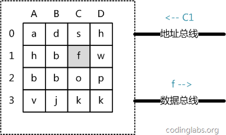

Mysql索引的高效性的原理得益于Mysql索引的实现，B+树，而B+树是B树的一种变种的数据结构，这两种数据结构都是为了磁盘和直接存储设备而设计的。是因为他们能够有效的减少磁盘IO过于频繁带来的磁盘读写效率低下问题，所以可以先了解下磁盘的读取原理再来分析B树和B+树应该就能迎刃而解了。
<!--more-->
## 计算机存储系统结构

#### 主存存取原理

目前计算机使用的主存基本是随机读写存储器（RAM）,现代RAM的结构和存取原理比较复杂，这里简单阐述下主存存取数据的基本原理。

从抽象的角度看，主存是由一系列的存储单元组成的矩阵，每个存储单元可以存储固定大小的数据。每个存储单元有唯一的地址，现代主存的编址规则比较复杂，这里将其简化成一个二维地址：通过一个行地址和一个列地址可以唯一定位到一个存储单元。如图展示了一个4 x 4的主存模型。

主存存取过程：
- 当系统从主存读取数据时，则将地址信号放到地址总线上，主存读到地址信号时，解析信号并定位到指定的存储单元，然后将存储单元的数据放到数据总线上，供其他部件读取。
- 当系统向主存写数据时，则将地址信号和数据分别放到地址总线和数据总线上，主存读取两个总线的内容，做响应的写操作。

#### 磁盘存取原理
磁盘是一个扁平的圆盘，盘面上有许多成为磁道的圆圈，磁道上有多个有号码标识的盘块组成，数据就记录在磁道上的每个盘块上。

该图是活动头盘示意图，指的是磁头是可以动的。磁盘上的数据可以由途中三个地址来标识：柱面号，盘面号，盘块号，这样磁头就能对应找到到底要在那个柱面方向的、哪个盘面中磁道中的、盘块来进行读写数据了。

磁盘读写的三个步骤：
- 移动 动臂 根据指定的柱面号将磁头移动到所在的柱面上（定位或查找）。
- 根据盘面号找到对应的磁盘。
- 盘面确定后，盘片开始绕主轴高速旋转，将指定盘块号的磁道移动到磁头下，这时，磁头就可以进行读写数据了。

其中，磁盘在读写数据是，它的定位寻址是比较耗时的。相比，磁盘高速旋转并不是很费时间，一般为7200转/分(电脑硬盘的性能指标之一, 家用的普通硬盘的转速一般有5400rpm(笔记本)、7200rpm几种)。因此一般旋转一圈大约0.0083s。所以，避免磁盘IO读写过于频繁，可以有效的提高超找效率。这就引申出后面我们所要讲的针对磁盘和直接存储设备而设计的B树和B+树了。

## 参考资料
[从B树、B+树、B*树谈到R 树](http://blog.csdn.net/v_july_v/article/details/6530142)
[MySQL索引背后的数据结构及算法原理](http://blog.codinglabs.org/articles/theory-of-mysql-index.html)